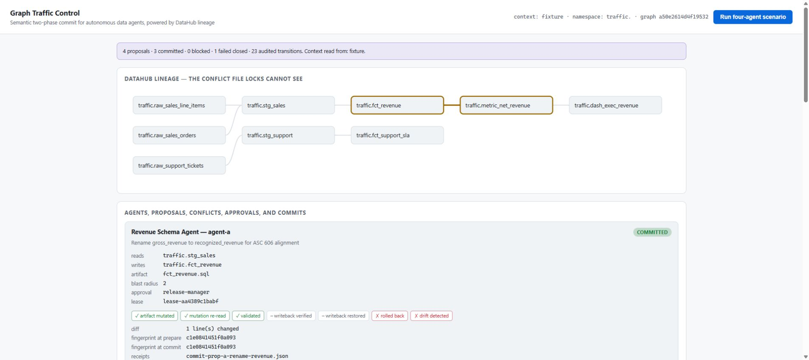
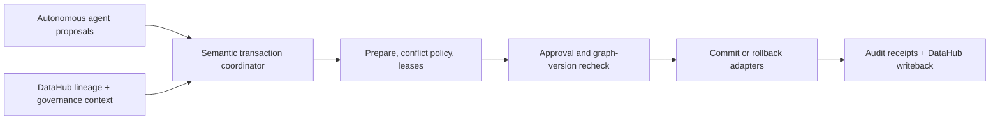

# Graph Traffic Control

[](https://github.com/amathias/graph-traffic-control/actions/workflows/ci.yml)

**Graph Traffic Control: Transactional Coordination for Data Agents**

[Open the live judge console](https://traffic.datahub-hackathon.aaronmathias.com) ·
[View the source](https://github.com/amathias/graph-traffic-control) ·
[Follow the under-three-minute recording runbook](docs/DEMO_RUNBOOK.md)

Demo video: **pending recording and public upload**. The repository does not claim that a video
exists yet.

Graph Traffic Control uses DataHub lineage and governance context to detect hidden conflicts between
autonomous data-agent changes, coordinate safe execution with a semantic two-phase commit, and
preserve an auditable record for the next agent.

Multiple agents can independently produce valid changes that become invalid when combined. One agent renames a column while another builds a metric on the old name; a third alters an upstream model whose blast radius overlaps both. File locks cannot see these semantic conflicts.

Graph Traffic Control requires every agent to propose its read set, write set, expected graph version, evidence, and intended change. The coordinator queries DataHub for indirect lineage collisions, runs policy and impact checks during a prepare phase, permits unrelated work in parallel, sequences or rejects conflicts, verifies the commit, and writes the outcome back to DataHub.



_The judge scenario exposes the dependency file locks cannot see, while an unrelated proposal
continues independently and every transition remains auditable._

## Architecture



## Three-step judge path

1. Open the live console and run the four-agent scenario.
2. Watch DataHub lineage expose the hidden rename/metric collision while unrelated work proceeds.
3. Inspect approval, lease, commit, rollback, verification, and append-only audit evidence.

## Quickstart

Requires Python 3.12+. No Docker, no npm, and no DataHub instance are needed to run what exists
today.

```bash
python -m venv .venv
.venv/Scripts/python.exe -m pip install -e ".[dev]"    # Windows
# source .venv/bin/activate && pip install -e ".[dev]"  # macOS / Linux

pytest                 # full suite, no network required
gtc-seed               # materialise deterministic demo state and SQL artifacts
gtc-api                # serve on http://127.0.0.1:8105
```

Then open **<http://127.0.0.1:8105/>** and press **Run four-agent scenario**.

That is the whole demo. The console shows the agents, their proposals, the DataHub lineage path
that proves the hidden conflict, leases, approvals, commits with every verification flag,
rollback, the append-only audit log, and the receipts behind it — with no DataHub instance, cloud
account, or paid service required. It states on screen which context source it read from.

Prefer a terminal? `gtc-demo` runs the same scenario and prints the trace.

```bash
curl http://127.0.0.1:8105/api/health
curl http://127.0.0.1:8105/api/readiness
curl http://127.0.0.1:8105/api/graph
```

Copy `.env.example` to `.env` to override defaults. DataHub connection variables are blank by
default; the application runs fixture-backed until they are supplied.

### All commands

| Command | What it does |
|---|---|
| `gtc-seed` / `gtc-reset` | Materialise or clear local demo state. Scoped to this project's state directory; cannot delete version-controlled fixtures. |
| `gtc-demo` | Run the four-agent scenario in the terminal. |
| `gtc-api` | Serve the API and the judge console. |
| `gtc-datahub-seed` | **Plan** the complete `traffic.` graph for DataHub — entities, schemas, ownership, domain, tag, marker, lineage. `--apply` needs live credentials. |
| `gtc-datahub-reset` | Plan removal of *this project's* entities only. A global refresh is refused. |
| `gtc-datahub-capture` | Record the pre-seed state of every allocated entity. `--allow-absent` records absence deliberately, for a first-time seed. |
| `gtc-datahub-restore` | Plan a return to the captured state. Entities captured as absent are soft-deleted, and their absence is verified after `--apply`. |
| `gtc-safety-scan` | Check git-tracked content for anything that must not be published. |
| `gtc-archive-verify` | Build the distributions and prove they install and run in a clean environment. |

The `gtc-datahub-*` commands **plan by default and never touch DataHub without `--apply`**. The
instance is shared with four other submissions, so "run it and see" must not be the easy path.

### First-time DataHub seeding

Capture has to run before seed, so a shared instance can be left as found. On the **first** run
there is nothing to read — the whole `traffic.` namespace is absent — so absence is what gets
captured, and it has to be asked for:

```bash
gtc-datahub-capture --allow-absent   # writes APP_STATE_DIR/datahub/pre_seed_capture.json
gtc-datahub-seed --apply             # creates exactly those URNs
# ... demo, writeback, receipts ...
gtc-datahub-restore --apply          # soft-deletes them again, then re-reads and proves it
```

Each command names the file it wrote. Under `APP_STATE_DIR/datahub/`:
`pre_seed_capture.json` (the recorded pre-seed state), `seed_plan.json`, `reset_plan.json`,
`restore_plan.json`, and `ingestion_recipe.yaml`. Restore reads `pre_seed_capture.json` from that
exact path and nowhere else, so it cannot be pointed at a capture from a different run.

Without `--allow-absent`, a missing entity is still a hard failure. That is the point: "the
namespace does not exist yet" and "half this project's rows have disappeared" look identical from
the outside, and only the operator knows which one is true. Every check is exact — a capture that
is partial, carries an extra or foreign URN, or lists a URN as both present and absent is refused
rather than turned into a wrong restore. See ADR-016 in `docs/DECISIONS.md`.

## What it does

### API documentation

Local, development, and test runs expose Swagger, ReDoc, and the generated OpenAPI document at
`/docs`, `/redoc`, and `/openapi.json`. The unauthenticated public judge deployment disables those
interactive routes. The public source, models, tests, CLI commands, and local OpenAPI output remain
the complete integration and self-hosting reference.

Agents submit structured proposals declaring intent, read set, write set, expected entity
versions, an executable action, a validation plan, and evidence. The coordinator then:

1. guards every URN against this project's `traffic.` allocation, failing closed;
2. reads the graph and rejects proposals whose expected versions are stale;
3. expands each proposal's impact through lineage within a bounded depth;
4. applies a deterministic conflict matrix, including **lineage-mediated conflicts between
   proposals that share no declared URN at all**;
5. grants expiring leases so unrelated work runs in parallel and abandoned work cannot block;
6. issues a prepared token fingerprinting the subgraph the proposal depends on;
7. **re-reads the graph immediately before commit and aborts on any drift**;
8. executes the change against a real local SQL artifact, validates it, and rolls back on failure;
9. performs one reversible DataHub writeback — capture, write, immediate re-read, restore;
10. writes sanitized proposal, lease, and commit receipts.

No language model participates in any conflict or commit decision.

### Why this is not file locking

Agent A renames a column on `traffic.fct_revenue`. Agent B publishes a metric in
`traffic.metric_net_revenue`. **Different files, different write targets, no overlap** — every
file-, branch-, or worktree-based coordinator says these are safe. They are not: the lineage path
`fct_revenue -> metric_net_revenue` means A's change reaches B's asset. The coordinator reports
that path as the conflict evidence. Meanwhile Agent C's support-branch change is lineage-disjoint
and commits in parallel rather than being serialised behind either of them.

### Two things worth knowing about how it fails

**Reads fail closed.** An MCP error or an unrecognised response shape aborts the read and says
so. It never becomes an empty graph — an empty graph is indistinguishable from a graph with no
conflicts, so degrading to one would silently turn "the coordinator cannot see the graph" into
"nothing conflicts, commit away".

**`COMMITTED` means proved, not attempted.** The artifact is re-read from disk and the DataHub
writeback is re-read from DataHub before a proposal is marked committed. Mutation, mutation
re-read, validation, writeback verification, writeback restoration, rollback, and receipts are
tracked as seven independent signals, and every commit receipt records which of them were true.

## Current status

Live: **<https://traffic.datahub-hackathon.aaronmathias.com>** — the judge console, no login, no
DataHub instance needed.

Implemented and tested: the conflict matrix, two-phase commit with pre-commit graph recheck,
expiring leases, real artifact mutation with rollback, verified reversible writeback, sanitized
receipts, non-mutating readiness over the complete catalogue, deterministic namespace-guarded
DataHub seed/reset/capture/restore planning, the judge console, release safety scanning, and
archive verification.

**The live DataHub gate is complete.** Against a shared open-source DataHub Core v1.6.0 instance:
strong readiness passed over the complete allocated catalogue — 9 entities and 7 lineage edges,
including the edge the headline conflict depends on; the project's graph was ingested as 49 typed
metadata change proposals; and a **reversible writeback was verified and restored** on a real
entity. Nothing outside this project's namespace was created, altered, or removed.

That gate was run by the portfolio coordinator, who holds the credentials. **No connection to the
shared instance has ever been made from this workspace** — here, the MCP client, context provider,
and writeback run against a strict localhost protocol double over real HTTP, and every result they
produce is labelled **simulated**.

[LIMITATIONS.md](./docs/LIMITATIONS.md) is the authoritative line between what was executed live,
what was executed offline, and what has not been executed at all.

Remaining: the recorded demo video.

## Workspace map

- [Project brief](./PROJECT_BRIEF.md)
- [Build plan](./BUILD_PLAN.md)
- [Implementation plan](./IMPLEMENTATION_PLAN.md)
- [Architecture decisions](./docs/DECISIONS.md)
- [Limitations and evidence status](./docs/LIMITATIONS.md)
- [Submission copy](./docs/SUBMISSION.md)
- [Demo runbook](./docs/DEMO_RUNBOOK.md)
- [Demo and submission](./DEMO_AND_SUBMISSION.md)
- [Hackathon rules](./HACKATHON_RULES.md)
- [AI builder instructions](./AGENTS.md)
- [Coordinator handoff](./COORDINATOR_HANDOFF.md)
